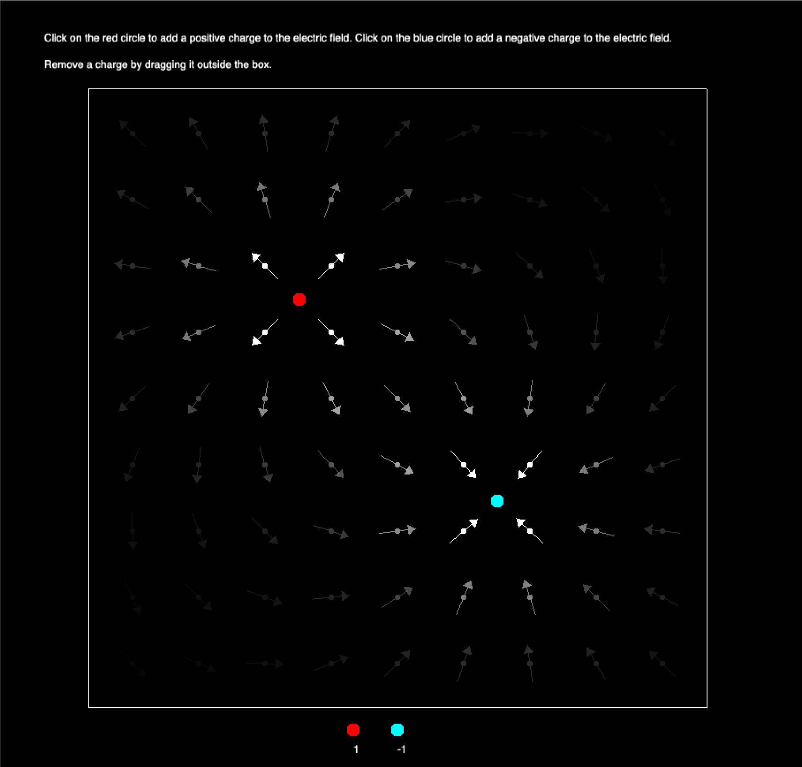

**Electric Field Simulation App**

The application simulates an electric field around charged particles. You can add positively and negatively charged
particles to the simulation by clicking on the red and blue circles at the bottom of the screen. Red circles represent
positive charges while blue circles represent negative charges.Once on the screen, the particles will produce an
electric field, represented by a vector field of arrows. Particles can be moved around the screen by dragging and
dropping. The color/shade of an arrow represents the strength of the vector field at that point. Solid arrows represent
stronger fields, while arrows in weaker fields are less visible. Charges can be removed from the simulation by dragging
them out of the electric field box.

**Setup**

MacOS
1. Navigate to ~/cmake-build-debug/Debug/field-simulation-app from the project directory.
2. Run field-simulation-app.app.
