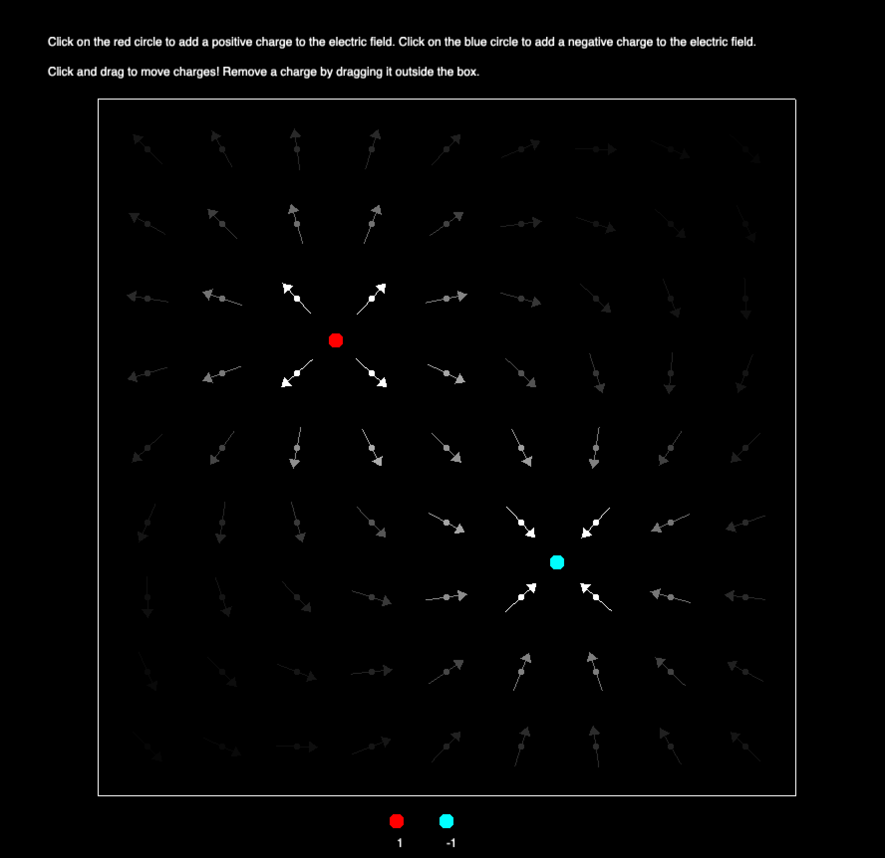

**Electric Field Simulation App**

The application simulates an electric field around charged particles. You can add positively and negatively charged
particles to the simulation by clicking on the red and blue circles at the bottom of the screen. Red circles represent
positive charges while blue circles represent negative charges.Once on the screen, the particles will produce an
electric field, represented by a vector field of arrows. Particles can be moved around the screen by dragging and
dropping. The color/shade of an arrow represents the strength of the vector field at that point. Solid arrows represent
stronger fields, while arrows in weaker fields are less visible. Charges can be removed from the simulation by dragging
them out of the electric field box.

**Setup**

**MacOS**

**Dependencies**

Install LibCinder

1. Download Cinder (v0.9.2) for your platform. Create a folder named Cinder and extract the downloaded item into it.
We’ll call this folder ~/Cinder throughout the instructions (where ~ represents the higher level directories that contains Cinder folder)
https://libcinder.org/download

2. If your directory structure looks like ~/Cinder/cinder_0.9.2_vc2015, then, you should get rid of the outer folder and refer to the inner folder as ~/Cinder

3. Open the ~/Cinder folder in CLion and click the green build button.
   

   
Alternatively (Without Clion)

1. Download Cinder (v0.9.2) for your platform from https://libcinder.org/download.
        Create a folder named Cinder and extract the downloaded item into it.
        We’ll call this folder ~/Cinder throughout the instructions
   
2. To build libcinder from the command line, first make sure you have CMake version 2.8 or later installed.
        Do the following from within the main cinder repo path:
   
        $ mkdir build
        $ cd build 
        $ cmake ..
        $ make -j4

**Building the app**

3. Create a directory for projects in the Cinder folder. Navigate to the projects folder and extract the zipped project folder/ clone project within it, and then open the project folder using CLion.
4. Load the Cmake project.

3. Navigate to ~/cmake-build-debug/Debug/field-simulation-app from the project directory.
4. Run field-simulation-app.app.
